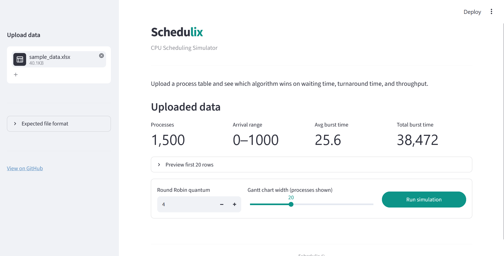
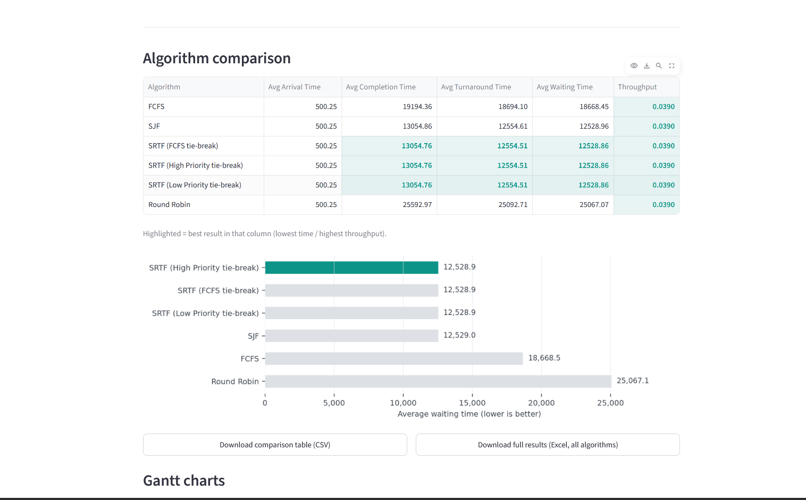
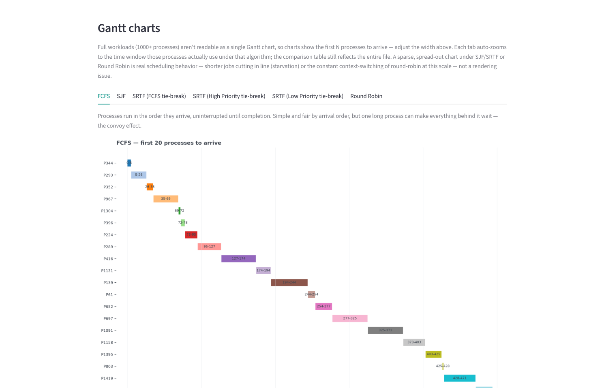

# Schedulix — CPU Scheduling Simulator

[](https://www.python.org/)
[](https://streamlit.io/)

A Streamlit app for an OS lab exercise: upload an Excel file of randomly generated
processes and compare **FCFS**, **SJF**, **SRTF** (three tie-break rules), and
**Round Robin** — averages, throughput, and a Gantt chart for each.

Repo: [github.com/muthokaricky-alt/Schedulix-](https://github.com/muthokaricky-alt/Schedulix-)

## Screenshots





## Setup

```bash
git clone https://github.com/muthokaricky-alt/Schedulix-.git
cd Schedulix-
pip install -r requirements.txt
```

## Usage

**1. Generate the process data.** The lab calls for 1500 randomly generated processes.

```bash
python generate_sample.py --n 1500 --seed 7
```

Writes `sample_data.xlsx` with `Process`, `Arrival Time`, `Burst Time`, `Priority`.
Run with `--help` to change the count, ranges, or output path.

**2. Run the app.**

```bash
streamlit run app.py
```

In the browser tab that opens: upload a file in the sidebar, set the Round Robin
quantum and Gantt chart width, then click **Run simulation**.

## What it shows

- Quick stats on the uploaded workload — process count, arrival range, burst time.
- A comparison table (average arrival, completion, turnaround, and waiting time,
  plus throughput) with the best result in each column highlighted, a bar chart
  ranking algorithms by average waiting time, and a one-line callout naming the
  winner.
- A Gantt chart per algorithm, tabbed, showing the first *N* processes **to
  arrive** (not sorted by ID — ID has no relationship to execution order, so
  an ID-based slice scatters a handful of processes across the entire
  simulated timeline instead of showing something readable). Each tab
  auto-zooms to the window those processes actually occupy under that
  algorithm. A sparse, spread-out chart under SJF/SRTF or Round Robin reflects
  real behavior — short jobs starving a long one, or round-robin's constant
  context-switching at scale — not a rendering issue.
- CSV downloads for the comparison table and each algorithm's per-process results,
  plus a single Excel workbook with every algorithm's full results on its own
  sheet (handy for a lab submission).
- A single, consistent look with one accent color (teal) applied across
  native widgets and custom UI alike, instead of colors drifting based on
  the OS's dark-mode preference.

## Input handling

Only `Arrival Time` and `Burst Time` are required. `Process` (auto-generated as
P1, P2, ...) and `Priority` (defaults to 0) are optional — a file with just two
columns still runs, though the two priority-based SRTF tie-breaks are equivalent
to the FCFS tie-break without real priority data. Non-numeric values, negative
arrival times, and burst times below 1 are rejected with a specific error message
instead of failing silently.

## Algorithms

| Algorithm | Type | Tie-break |
|---|---|---|
| FCFS | Non-preemptive | Arrival time, then process ID |
| SJF | Non-preemptive | Shortest burst; ties broken FCFS |
| SRTF (FCFS tie-break) | Preemptive | Shortest remaining time; ties broken FCFS |
| SRTF (High Priority tie-break) | Preemptive | Shortest remaining time; ties broken by the **higher** priority integer |
| SRTF (Low Priority tie-break) | Preemptive | Shortest remaining time; ties broken by the **lower** priority integer |
| Round Robin | Preemptive | Fixed time quantum, FIFO ready queue |

**Metrics** (n = number of processes):

- Completion Time (CT) — when a process finishes
- Turnaround Time (TAT) = CT − Arrival Time
- Waiting Time (WT) = TAT − Burst Time
- Throughput = n ÷ (max Completion Time − min Arrival Time)

All algorithms are simulated **event-driven**, not tick-by-tick: scheduling
decisions are only re-evaluated at arrivals and completions, using a heap (SJF,
SRTF) or a FIFO queue (Round Robin). That keeps 1500+ processes running in well
under a second across all six variants.

## Project structure

```
Schedulix/
├── app.py                 # Streamlit UI
├── scheduler.py           # Scheduling algorithms
├── generate_sample.py     # Random process generator (Excel output)
├── requirements.txt
├── sample_data.xlsx       # 1500 pre-generated processes (seed=7)
├── .streamlit/
│   └── config.toml        # Accent color + font only
├── docs/
│   ├── screenshot-main.png        # add your own — see Screenshots above
│   ├── screenshot-comparison.png
│   └── screenshot-gantt.png
├── .gitignore
└── README.md
```

```
